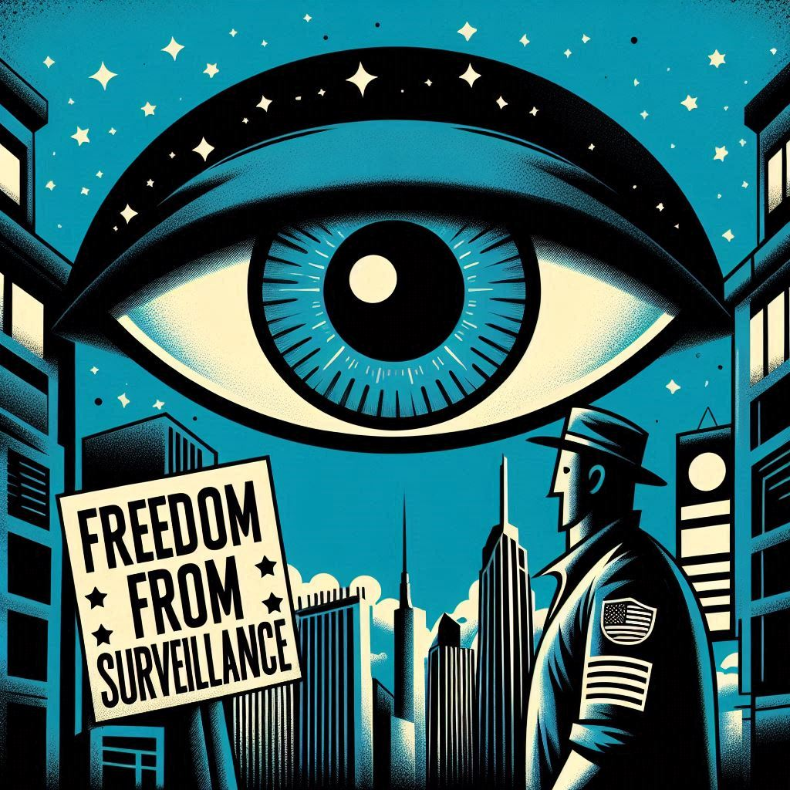

# George-was-Right-v2 - README.md


George-was-Right-v2 leverages a team of AI agents, powered by CrewAI, to analyze recent world events through the lens of themes from George Orwell's *1984*. It orchestrates four specialized agents—Researcher, Writer, Illustrator, and Editor—to perform tasks such as:

- Searching for relevant news.
- Comparing news with themes from *1984*.
- Writing articles.
- Generating illustration prompts to accompany analyses.

This project aims to provide a nuanced examination of how contemporary society reflects Orwellian concerns about digital privacy and freedom, fostering meaningful discussion and awareness.

---



---

## Features and Roadmap

### Current Features

- **Automated Research and Analysis:** Gathers and analyzes news stories in relation to *1984* themes.
- **Multi-Agent Collaboration:** Uses specialized AI agents to divide and conquer complex tasks.
- **Visual Prompt Generation:** Produces creative prompts for illustrations to enhance storytelling and audience engagement.
- **Clear and Structured Output:** Outputs organized markdown reports combining research, analysis, and visuals.

### Upcoming Enhancements

- **Customizable Search Parameters:** Add options for users to specify country and the number of search results for focused research.
- **GUI Integration:** Develop a user-friendly graphical interface for seamless control of the analysis process.
- **Refined Output Formats:** Improve markdown and PDF exports for clarity and usability.
- **Incremental Feature Rollout:** Continuously implement new features while maintaining backward compatibility.

---


---

## Project History

This is the second iteration of George-was-Right. The original version, a simple Python project, became unmanageable due to accumulating changes and a lack of version control. Starting fresh enabled a focus on better coding practices, structured development, and Git-based version control.

### Lessons Learned

- Importance of planning and incremental development.
- Effective use of Git for managing changes.
- Best practices for Python project structuring and imports.
- Benefits of regular backups and separating development from production environments.

---


---

## Getting Started

Follow these steps to set up the project:

1. Clone the repository:

   ```bash
   git clone https://github.com/TheRealFREDP3D/George-was-Right-v2.git
   ```

2. Navigate to the project directory:

   ```bash
   cd George-was-Right-v2
   ```

3. Create a virtual environment:

   ```bash
   python -m venv venv
   ```

4. Activate the virtual environment:
   - On Windows:

     ```bash
     venv\Scripts\activate
     ```

   - On macOS/Linux:

     ```bash
     source venv/bin/activate
     ```

5. Install dependencies:

   ```bash
   pip install -r requirements.txt
   ```

6. Run the project:

   ```bash
   python main.py
   ```

**Requirements:**

- Python 3.8 or later
- Internet connection for AI-powered agents or use Ollama for local usage.

---

## Contributing

Contributions are welcome! To contribute:

1. Fork the repository.
2. Create a feature branch:

   ```bash
   git checkout -b feature/your-feature-name
   ```

3. Commit your changes:

   ```bash
   git commit -m "Add your message here"
   ```

4. Push the branch to your fork:

   ```bash
   git push origin feature/your-feature-name
   ```

5. Submit a pull request.

Please ensure changes are well-tested and documented. Refer to the [Contribution Guide](CONTRIBUTING.md) for more details.

---

## About the Author

My name is Frederick Pellerin, a Python enthusiast and aspiring IT professional. I have a keen interest in Python, AI, and cybersecurity and am currently exploring creative projects to deepen my learning.

### Contact Information

| **Contact**        | **Links**                                                             |
|--------------------|-----------------------------------------------------------------------|
| Twitter            | [@TheRealFredP3D](https://twitter.com/TheRealFredP3D)                 |
| GitHub             | [@TheRealFREDP3D](https://github.com/TheRealFREDP3D)                  |
| Email              | [fredp3d@proton.me](mailto:fredp3d@proton.me)                         |
| Link Gallery       | [LinkGallery](http://link.gallery/therealfredp3d)                     |

---

**License:** MIT License. See the [LICENSE](LICENSE) file for details.

**Last Modified:** December 21, 2024
