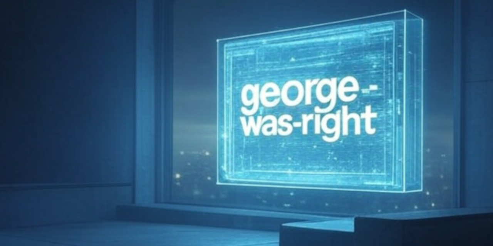
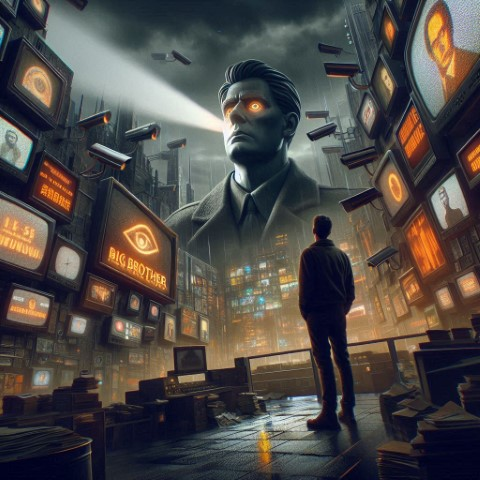

# George-Was-Right v0.3 - README.md



George_Was_Right leverages a team of AI agents, powered by CrewAI, to analyze recent world events through the lens of themes from George Orwell's *1984*. It orchestrates four specialized agents—Researcher, Writer, Illustrator, and Editor—to perform tasks such as:

- Searching for relevant news.
- Comparing news with themes from *1984*.
- Writing articles.
- Generating illustration prompts to accompany analyses.

This project aims to provide a nuanced examination of how contemporary society reflects Orwellian concerns about digital privacy and freedom, fostering meaningful discussion and awareness.

---


---

## Features and Roadmap

### Current Features

- **Automated Research and Analysis:** Gathers and analyzes news stories in relation to *1984* themes.
- **Multi-Agent Collaboration:** Uses specialized AI agents to divide and conquer complex tasks.
- **Visual Prompt Generation:** Produces creative prompts for illustrations to enhance storytelling and audience engagement.
- **Clear and Structured Output:** Outputs organized markdown reports combining research, analysis, and visuals.

### Upcoming Enhancements

- **Customizable Search Parameters:** Add options for users to specify country and the number of search results for focused research.
- **GUI Integration:** Develop a user-friendly graphical interface for seamless control of the analysis process.
- **Refined Output Formats:** Improve markdown and PDF exports for clarity and usability.
- **Incremental Feature Rollout:** Continuously implement new features while maintaining backward compatibility.

---

(images/.surveillancedark-city4.jpg)

---

## Project History

George-Was-Right is a project I’ve been working on to learn Python. I needed  way to get hands-on with programming and not just read about it.

Like a lot of people during the pandemic, I was stuck at home with too much time on my hands. That’s when I decided to finally dive back into coding. I had just finished reading '1984' and taught, “Why not make something in George Orwell’s world?” My first idea was to make a small game. I wasn't really serious about this project until I discovered LLMs, Ollama and CrewAI. My project idea took a hard left turn. It was definitely a stretch for my skills at the time, but I love a good challenge. It forced me to read, learn, and experiment. Plus, who doesn’t like an excuse to Google stuff?

What started as a “just for fun” hobby has turned into something more. I’m working on it in my spare time because, well, it’s fun and satisfying. At 40, I’ve finally found something I actually enjoy doing—and I’m starting to think it might be time for a career change. During daytime, I work at a private yacht club doing maintenance, building, and fixing things, mainly around the property and boats. No computers in sight, which is actually a bit wild when I think about it now. But here I am, trying to figure out Python while also being a handyman.

So, I’m cooking up an "exit plan" from the yacht life and trying to carve out some time to dive deeper into tech. Wish me luck!

This is the second iteration of George-was-Right. The original version became unmanageable due to accumulating changes and a lack of version control. Starting fresh enabled a focus on better coding practices, structured development, and Git-based version control.

I hope you find this project interesting.

---

### Lessons Learned the Hard Way

- Importance of planning and incremental development.
- Effective use of Git for managing changes.
- Best practices for Python project structuring and imports.
- Benefits of regular backups and separating development from production environments.
- Keeping notes and keep documentation updated.

---


---

## Getting Started

Follow these steps to set up the project:

1. Clone the repository:

   ```bash
   git clone https://github.com/TheRealFREDP3D/George_Was_Right.git
   ```

2. Navigate to the project directory:

   ```bash
   cd George_Was_Right
   ```

3. Create a virtual environment:

   ```bash
   python -m venv venv
   ```

4. Activate the virtual environment:
   - On Windows:

     ```bash
     venv\Scripts\activate
     ```

   - On macOS/Linux:

     ```bash
     source venv/bin/activate
     ```

5. Install dependencies:

   ```bash
   pip install -r requirements.txt
   ```

6. Run the project:

   ```bash
   python main.py
   ```

---

**Requirements:**

- Python 3.8 or later
- Internet connection for AI-powered agents or use Ollama for local usage.

---

## Contributing

Contributions are welcome! To contribute:

1. Fork the repository.
2. Create a feature branch:

   ```bash
   git checkout -b feature/your-feature-name
   ```

3. Commit your changes:

   ```bash
   git commit -m "Add your message here"
   ```

4. Push the branch to your fork:

   ```bash
   git push origin feature/your-feature-name
   ```

5. Submit a pull request.

Please ensure changes are well-tested and documented. Refer to the [Contribution Guide](CONTRIBUTING.md) for more details.

---

## Contact

| **Contact**        | **Links**                                                             |
|--------------------|-----------------------------------------------------------------------|
| Twitter            | [@TheRealFredP3D](https://twitter.com/TheRealFredP3D)                 |
| GitHub             | [@TheRealFREDP3D](https://github.com/TheRealFREDP3D)                  |
| Email              | [fredp3d@proton.me](mailto:fredp3d@proton.me)                         |
| Link Gallery       | [LinkGallery](http://link.gallery/therealfredp3d)                     |

---

**License:** MIT License. See the [LICENSE](LICENSE) file for details.  

---



**Modified:** December 24, 2024
