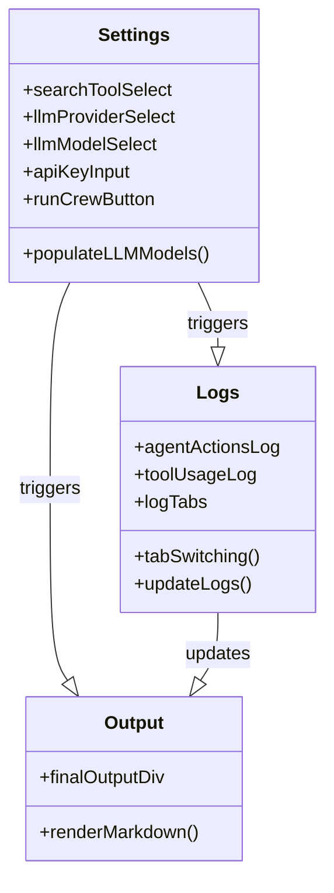
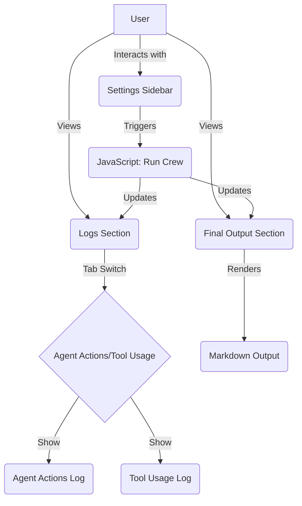

# Pull Request #14 - Reviewer's Guide

Initial implementation of the CrewAI web interface, introducing a structured HTML layout, comprehensive CSS styling with a Dark Blue, Ivory, and Copper theme, and JavaScript logic to mock dynamic settings population, live logs, tab navigation, and Markdown rendering placeholders.

#### Class diagram for main JavaScript UI components

#### Flow diagram for CrewAI web interface structure

### File-Level Changes

| Change | Details | Files |
| ------ | ------- | ----- |
| Created the HTML structure for the web UI | <ul><li>Defined header, settings sidebar, logs section, output area, and footer</li><li>Inserted containers and tabs for agent actions and tool usage logs</li><li>Linked external stylesheet and script files for styling and functionality</li></ul> | `src/web/index.html` |
| Added stylesheet with theme and responsive layout | <ul><li>Applied global CSS resets, typography, and color variables</li><li>Styled container, header, main grid, settings panel, logs, and output with Dark Blue, Ivory, and Copper accents</li><li>Implemented responsive adjustments for mobile viewports</li></ul> | `src/web/style.css` |
| Implemented JavaScript for dynamic UI behavior | <ul><li>Populated LLM models based on provider selection</li><li>Mocked run workflow: settings capture, live log updates, and simulated final output</li><li>Added tab-switching logic for log views</li><li>Placeholder functions for backend API integration and simple Markdown rendering</li></ul> | `src/web/script.js` |

---

Tips and commands

#### Interacting with Sourcery

- **Trigger a new review:** Comment `@sourcery-ai review` on the pull request.
- **Continue discussions:** Reply directly to Sourcery's review comments.
- **Generate a GitHub issue from a review comment:** Ask Sourcery to create an
  issue from a review comment by replying to it. You can also reply to a
  review comment with `@sourcery-ai issue` to create an issue from it.
- **Generate a pull request title:** Write `@sourcery-ai` anywhere in the pull
  request title to generate a title at any time. You can also comment
  `@sourcery-ai title` on the pull request to (re-)generate the title at any time.
- **Generate a pull request summary:** Write `@sourcery-ai summary` anywhere in
  the pull request body to generate a PR summary at any time exactly where you
  want it. You can also comment `@sourcery-ai summary` on the pull request to
  (re-)generate the summary at any time.
- **Generate reviewer's guide:** Comment `@sourcery-ai guide` on the pull
  request to (re-)generate the reviewer's guide at any time.
- **Resolve all Sourcery comments:** Comment `@sourcery-ai resolve` on the
  pull request to resolve all Sourcery comments. Useful if you've already
  addressed all the comments and don't want to see them anymore.
- **Dismiss all Sourcery reviews:** Comment `@sourcery-ai dismiss` on the pull
  request to dismiss all existing Sourcery reviews. Especially useful if you
  want to start fresh with a new review - don't forget to comment
  `@sourcery-ai review` to trigger a new review!

#### Customizing Your Experience

Access your [dashboard](https://app.sourcery.ai) to:
- Enable or disable review features such as the Sourcery-generated pull request
  summary, the reviewer's guide, and others.
- Change the review language.
- Add, remove or edit custom review instructions.
- Adjust other review settings.

#### Getting Help

- [Contact our support team](mailto:support@sourcery.ai) for questions or feedback.
- Visit our [documentation](https://docs.sourcery.ai) for detailed guides and information.
- Keep in touch with the Sourcery team by following us on [X/Twitter](https://x.com/SourceryAI), [LinkedIn](https://www.linkedin.com/company/sourcery-ai/) or [GitHub](https://github.com/sourcery-ai).

<!-- Generated by sourcery-ai[bot]: end review_guide -->
