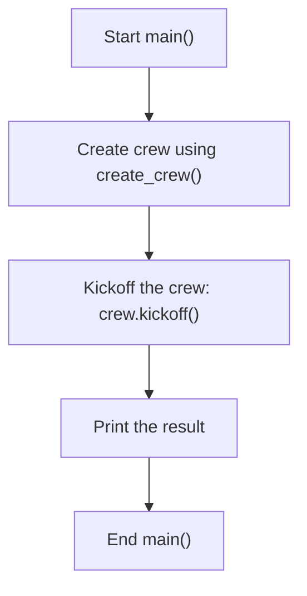
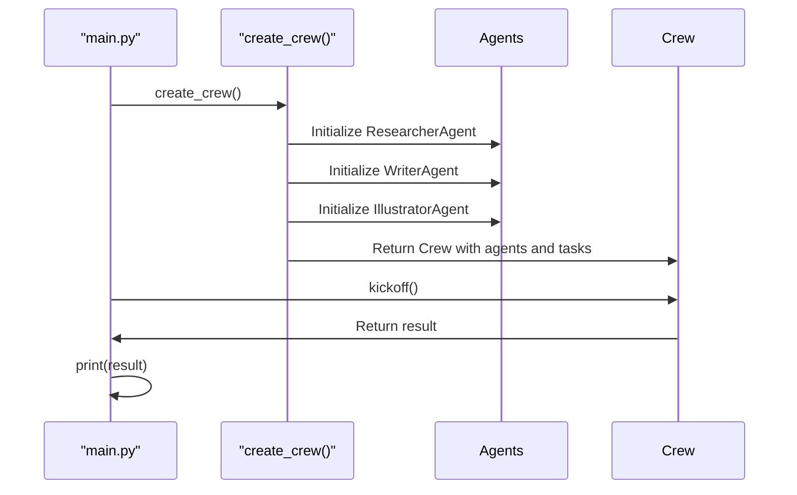

# George-Was-Right-v2 - /docs/v0.2-Flowchart.md

## Introduction

The project involves several steps including setting up the environment, defining agent roles, creating a crew, and executing tasks. The flowchart below shows the basic steps of the project.

The program execute and generates the expected content.

---

## Diagrams

### Flowchart

---

### Sequence Diagram

To provide a sequence diagram for the `main.py`, let's focus on the interaction between the main function and the crew creation and kickoff process.

---
