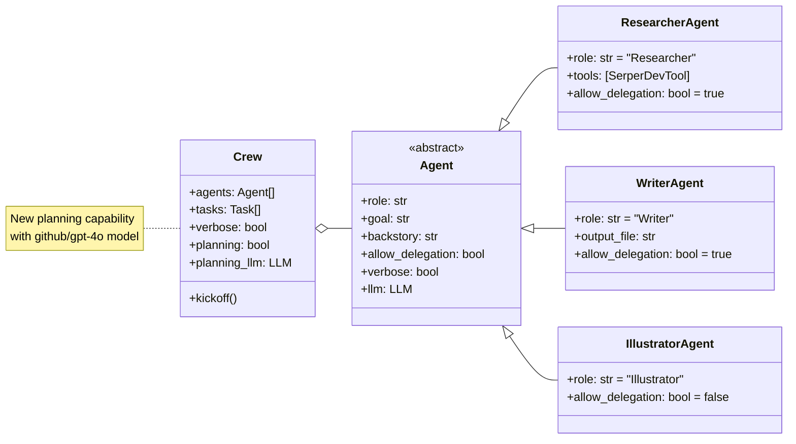

```mermaid
classDiagram
    direction LR
    class Agent {
        <<abstract>>
        +role: str
        +goal: str
        +backstory: str
        +allow_delegation: bool
        +verbose: bool
        +llm: LLM
    }

    class ResearcherAgent {
        +role: str = "Researcher"
        +tools: [SerperDevTool]
        +allow_delegation: bool = true
    }

    class WriterAgent {
        +role: str = "Writer"
        +output_file: str
        +allow_delegation: bool = true
    }

    class IllustratorAgent {
        +role: str = "Illustrator"
        +allow_delegation: bool = false
    }

    class Crew {
        +agents: Agent[]
        +tasks: Task[]
        +verbose: bool
        +planning: bool
        +planning_llm: LLM
        +kickoff()
    }

    Agent <|-- ResearcherAgent
    Agent <|-- WriterAgent
    Agent <|-- IllustratorAgent
    Crew o-- Agent
    note for Crew "New planning capability
with github/gpt-4o model"
```