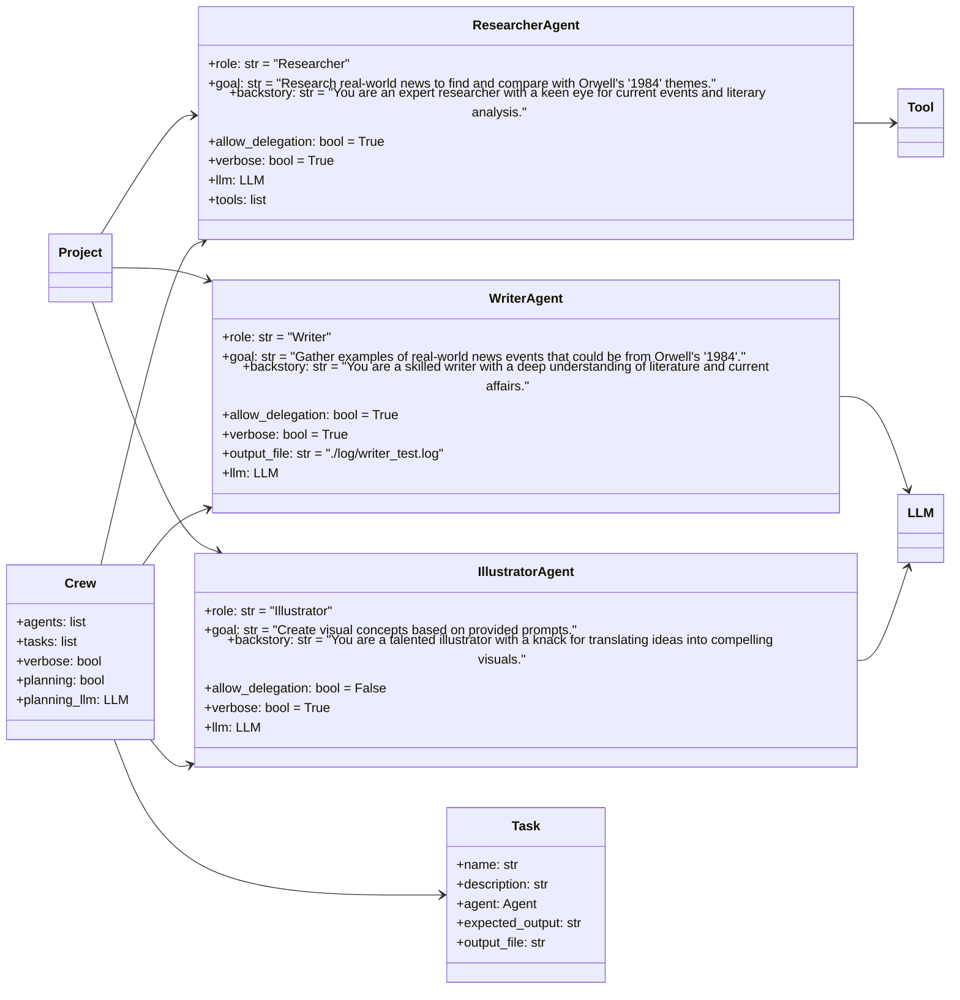

```mermaid
classDiagram
  direction LR

  class Project {
  }

  class ResearcherAgent {
      +role: str = "Researcher"
      +goal: str = "Research real-world news to find and compare with Orwell's '1984' themes."
      +backstory: str = "You are an expert researcher with a keen eye for current events and literary analysis."
      +allow_delegation: bool = True
      +verbose: bool = True
      +llm: LLM
      +tools: list
  }

  class WriterAgent {
      +role: str = "Writer"
      +goal: str = "Gather examples of real-world news events that could be from Orwell's '1984'."
      +backstory: str = "You are a skilled writer with a deep understanding of literature and current affairs."
      +allow_delegation: bool = True
      +verbose: bool = True
      +output_file: str = "./log/writer_test.log"
      +llm: LLM
  }

  class IllustratorAgent {
      +role: str = "Illustrator"
      +goal: str = "Create visual concepts based on provided prompts."
      +backstory: str = "You are a talented illustrator with a knack for translating ideas into compelling visuals."
      +allow_delegation: bool = False
      +verbose: bool = True
      +llm: LLM
  }

  class Task {
      +name: str
      +description: str
      +agent: Agent
      +expected_output: str
      +output_file: str
  }

  class Crew {
      +agents: list
      +tasks: list
      +verbose: bool
      +planning: bool
      +planning_llm: LLM
  }

  Project --> ResearcherAgent
  Project --> WriterAgent
  Project --> IllustratorAgent
  ResearcherAgent --> Tool
  WriterAgent --> LLM
  IllustratorAgent --> LLM
  Crew --> Task
  Crew --> ResearcherAgent
  Crew --> WriterAgent
  Crew --> IllustratorAgent
```
