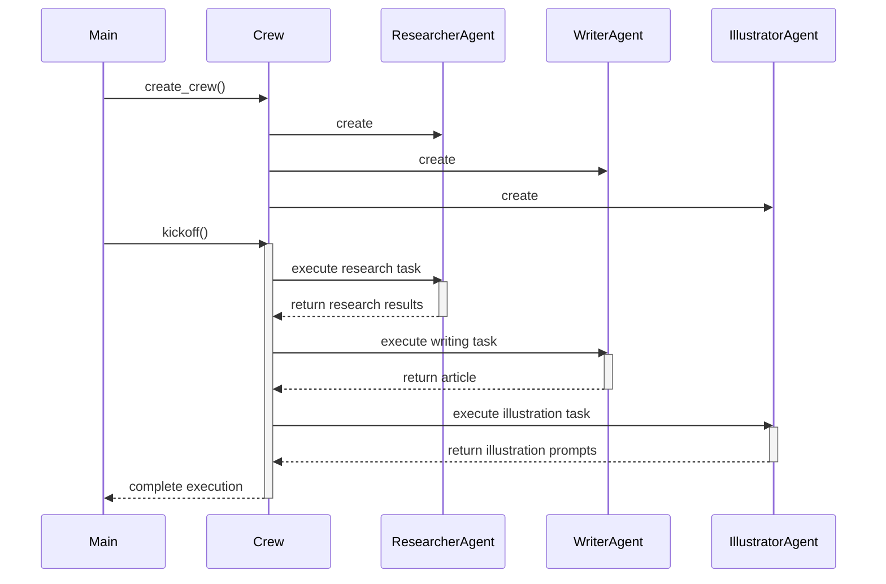

```mermaid
sequenceDiagram
    participant M as Main
    participant C as Crew
    participant R as ResearcherAgent
    participant W as WriterAgent
    participant I as IllustratorAgent

    M->>C: create_crew()
    C->>R: create
    C->>W: create
    C->>I: create

    M->>C: kickoff()
    activate C

    C->>R: execute research task
    activate R
    R-->>C: return research results
    deactivate R

    C->>W: execute writing task
    activate W
    W-->>C: return article
    deactivate W

    C->>I: execute illustration task
    activate I
    I-->>C: return illustration prompts
    deactivate I

    C-->>M: complete execution
    deactivate C
```