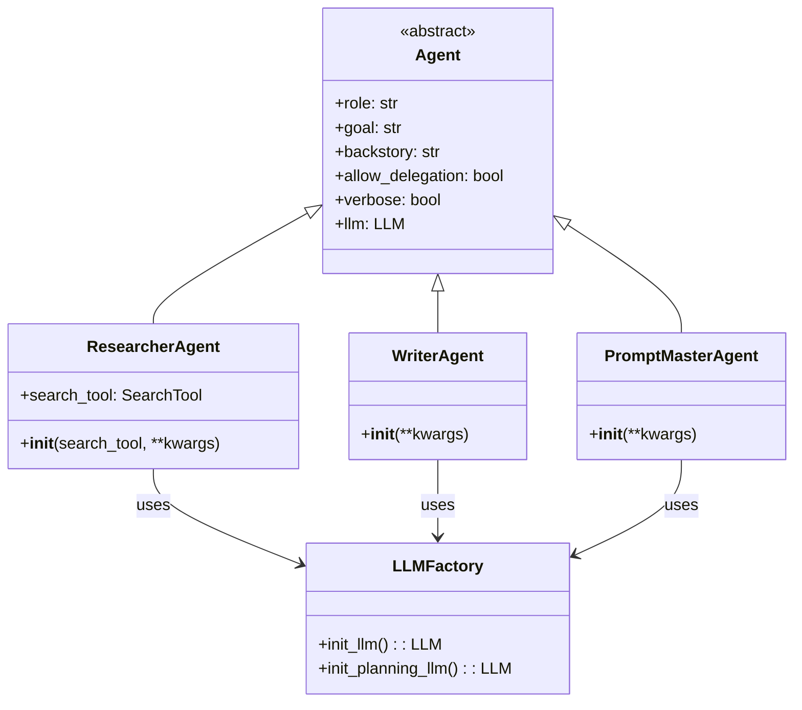
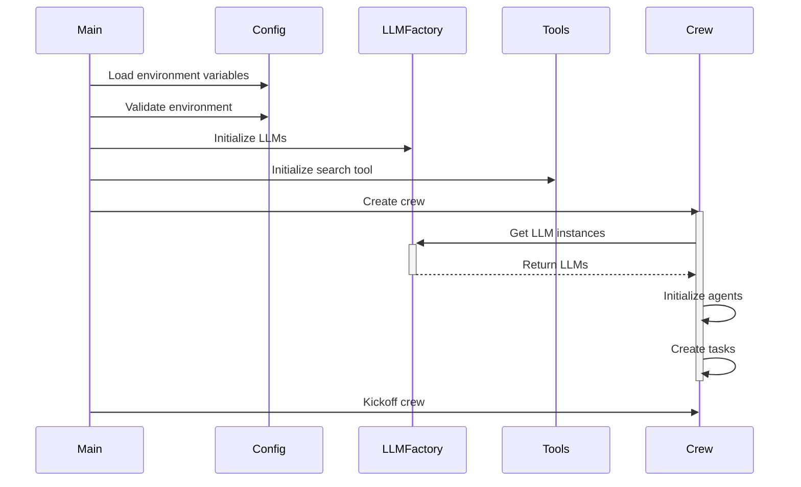

# George_Was_Right v0.4 - Diagrams - /main.py

|               |                                                                          |  
|---------------|--------------------------------------------------------------------------|  
| **File**      | docs\v0.4-Diagrams.md                                                    |  
| **Author**    | Frederick Pellerin <fredp3d@proton.me>                                   |  
| **Github**    | [https://github.com/TheRealFREDP3D/](https://github.com/TheRealFREDP3D/) |  
| **Twitter/X** | [https://x.com/TheRealFredP3D/](https://x.com/TheRealFredP3D/)           |  
| **Modified**  | 29-12-2024                                                               |

---

## Diagrams

---

### Class Diagram

---

### Sequence Diagram

