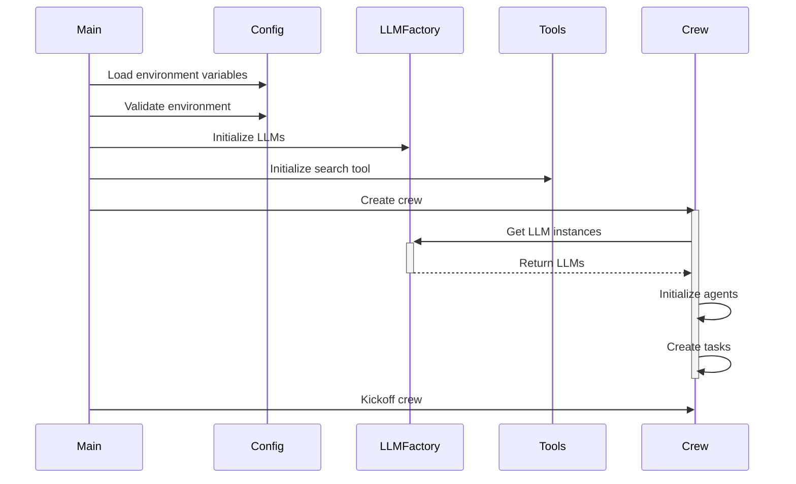

# George_Was_Right - /docs/v0.4-Sequence-Diagram.md

```mermaid
sequenceDiagram
    participant M as Main
    participant C as Config
    participant L as LLMFactory
    participant T as Tools
    participant CR as Crew

    M->>C: Load environment variables
    M->>C: Validate environment
    M->>L: Initialize LLMs
    M->>T: Initialize search tool

    M->>CR: Create crew
    activate CR
    CR->>+L: Get LLM instances
    L-->>-CR: Return LLMs

    CR->>CR: Initialize agents
    CR->>CR: Create tasks
    deactivate CR

    M->>CR: Kickoff crew
```
