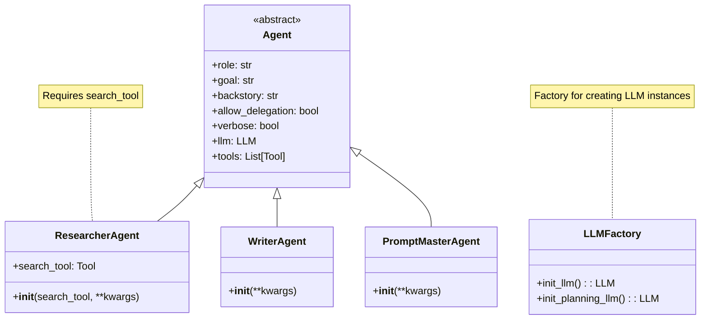

# v0.6 - Diagrams

```mermaid
classDiagram
    class Agent {
        <<abstract>>
        +role: str
        +goal: str
        +backstory: str
        +allow_delegation: bool
        +verbose: bool
        +llm: LLM
        +tools: List[Tool]
    }

    class ResearcherAgent {
        +search_tool: Tool
        +__init__(search_tool, **kwargs)
    }

    class WriterAgent {
        +__init__(**kwargs)
    }

    class PromptMasterAgent {
        +__init__(**kwargs)
    }

    class LLMFactory {
        +init_llm(): LLM
        +init_planning_llm(): LLM
    }

    Agent <|-- ResearcherAgent
    Agent <|-- WriterAgent
    Agent <|-- PromptMasterAgent

    note for ResearcherAgent "Requires search_tool"
    note for LLMFactory "Factory for creating LLM instances"
```
